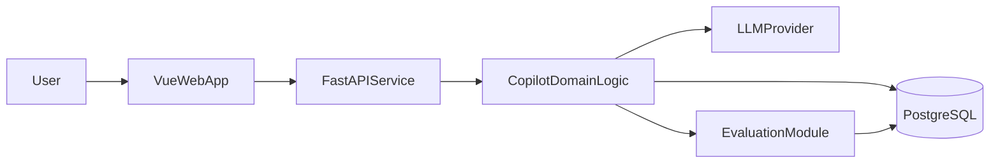

# 求职 AI Copilot（Python + Vue）实施方案（已更新进度）

## 0. 当前进度总览（2026-04-30）

- 总体状态：核心 MVP 闭环已完成（JD 解析 -> 简历匹配 -> 模拟面试 -> 训练计划）。
- To-do 状态：`init-skeleton`、`build-core-flow`、`persist-reports`、`add-evaluation`、`stabilize-and-demo` 均已完成。
- 当前重点：补强“真实模型接入、数据库迁移、评测扩容、可演示证据”。

### 已落地文件（关键）

- 后端入口与路由：
  - `backend/app/main.py`
  - `backend/app/api/routes.py`
- 数据模型与仓储：
  - `backend/app/models/entities.py`
  - `backend/app/repositories/copilot_repo.py`
- 核心服务：
  - `backend/app/services/jd_parser.py`
  - `backend/app/services/resume_matcher.py`
  - `backend/app/services/interview_engine.py`
  - `backend/app/services/plan_generator.py`
  - `backend/app/services/llm_client.py`
- 前端页面：
  - `frontend/src/pages/JDAnalyze.vue`
  - `frontend/src/pages/ResumeMatch.vue`
  - `frontend/src/pages/MockInterview.vue`
  - `frontend/src/pages/ImprovementPlan.vue`
- 评测与文档：
  - `backend/eval/run_eval.py`
  - `backend/eval/sample_eval_set.json`
  - `README.md`

## 1. 目标与范围

项目目标：做出一个面向应届生的求职 Copilot，完成“岗位解析 -> 简历对齐 -> 模拟面试 -> 改进计划”的闭环。

MVP 范围（首版必须完成）：
- JD 解析：抽取技能要求、职责、加分项。
- 简历匹配：给出匹配分、缺口分析、逐段改写建议。
- 模拟面试：按岗位生成问题，记录用户回答，输出评分与反馈。
- 训练计划：根据短板生成 7 天提升任务。
- 结果可追踪：保存每次分析和面试结果，支持回看。

暂不做（后置）：
- 复杂权限系统（先单用户本地登录或免登录）。
- 多租户与企业级管理后台。
- 语音实时面试（先文本版）。

## 2. 技术架构（按你当前技术栈）

- 前端：Vue3 + Vite + Pinia + Vue Router + Element Plus（或 Naive UI）
- 后端：Python FastAPI + Pydantic + SQLAlchemy
- 数据库：PostgreSQL（本地可用 Docker）
- 检索与向量（可选，二期）：pgvector 或 Milvus（先从 pgvector 开始）
- 模型层：LLM API（OpenAI/通义/DeepSeek 任一）+ Prompt 模板管理
- 异步任务：Celery + Redis（MVP 可先同步，二期再异步）
- 评测：自建评测脚本（Python）+ 基础指标落库

## 3. 数据库设计（核心表）

建议的核心数据模型：
- `users`
  - `id`, `email`, `name`, `created_at`
- `resumes`
  - `id`, `user_id`, `title`, `raw_text`, `structured_json`, `version`, `created_at`
- `job_descriptions`
  - `id`, `source`, `company`, `role`, `raw_text`, `parsed_json`, `created_at`
- `resume_match_reports`
  - `id`, `user_id`, `resume_id`, `jd_id`, `match_score`, `gap_json`, `rewrite_suggestions_json`, `created_at`
- `interview_sessions`
  - `id`, `user_id`, `jd_id`, `status`, `overall_score`, `summary`, `created_at`
- `interview_questions`
  - `id`, `session_id`, `question_text`, `dimension`（基础/项目/行为）, `difficulty`
- `interview_answers`
  - `id`, `question_id`, `answer_text`, `score`, `feedback_json`, `created_at`
- `improvement_plans`
  - `id`, `user_id`, `session_id`, `plan_json`, `start_date`, `created_at`
- `llm_logs`
  - `id`, `scene`, `prompt_version`, `input_tokens`, `output_tokens`, `latency_ms`, `cost_estimate`, `created_at`

设计原则：
- 原始文本与结构化结果分开存储，便于重跑解析。
- 每次分析保留快照，保证可回溯（方便答辩展示“前后提升”）。
- 提前记录 token/延迟，后续做成本优化有数据依据。

## 4. 模块拆分（后端 + 前端）

后端模块（FastAPI）：
- `api/`：路由层（REST）
- `services/jd_parser.py`：JD 信息抽取
- `services/resume_matcher.py`：简历匹配与改写建议
- `services/interview_engine.py`：问题生成、评分、反馈
- `services/plan_generator.py`：7 天训练计划
- `services/llm_client.py`：模型调用抽象（可切换供应商）
- `repositories/`：数据库读写
- `eval/`：离线评测脚本与指标计算

前端模块（Vue）：
- `pages/JDAnalyze.vue`：JD 上传与解析
- `pages/ResumeMatch.vue`：匹配报告与改写建议
- `pages/MockInterview.vue`：模拟面试流程
- `pages/ImprovementPlan.vue`：训练计划看板
- `stores/`：用户状态、会话状态、报告缓存
- `api/`：请求封装（Axios）

接口建议（MVP）：
- `POST /jd/parse`
- `POST /resume/match`
- `POST /interview/session`
- `POST /interview/{session_id}/answer`
- `GET /interview/{session_id}/report`
- `POST /plan/generate`

## 5. 每周开发计划（8 周）

### 第 1 周：需求收敛与项目骨架
- 明确 3 类目标岗位（如后端/算法/前端）
- 建 FastAPI + Vue 工程骨架、数据库连接、基础页面
- 定义 Prompt v1 与接口契约
- 状态：已完成（代码骨架、配置和启动文档已具备）

### 第 2 周：JD 解析与简历结构化
- 完成 `JD 解析` API 和前端展示
- 完成简历文本上传、结构化抽取
- 落库并支持历史记录查看
- 状态：已完成（`/jd/parse`、`/resume/match`、历史查询已实现）

### 第 3 周：简历匹配报告
- 生成匹配分、技能缺口、关键词覆盖率
- 输出逐段改写建议（按项目经历/技能/自我介绍）
- 前端完成“原文 vs 建议”对照视图
- 状态：已完成（匹配分/缺口/改写建议已落库并可前端展示）

### 第 4 周：模拟面试 MVP
- 按岗位生成 10-15 道问题
- 用户回答后给分与反馈（分维度）
- 生成单次面试总结
- 状态：已完成（会话创建、答题评分、报告汇总已打通）

### 第 5 周：改进计划与闭环
- 基于面试结果生成 7 天训练计划
- 支持计划打卡（完成/未完成）
- 形成“再面一次”的闭环链路
- 状态：部分完成（7 天训练计划已实现；“打卡状态持久化”待增强）

### 第 6 周：评测体系（关键加分项）
- 构建小型测试集（30-50 条）
- 指标：相关性、建议可执行性、评分稳定性、延迟
- 输出评测报告页面（或导出 JSON/Markdown）
- 状态：部分完成（已有评测脚本与样例集；样本规模与指标维度待扩展）

### 第 7 周：工程化与稳定性
- 增加错误处理、重试、日志、限流
- 加入基础缓存（相同 JD/简历命中）
- 记录 token 与耗时，做成本分析
- 状态：已完成（基础版，后续可接入更完善观测平台）

### 第 8 周：演示与求职包装
- 准备 Demo 脚本（3 分钟）
- 写项目文档：架构、难点、指标、优化
- 准备面试讲述：为什么做、怎么做、效果如何
- 状态：进行中（`README.md` 已完成，演示脚本与答辩材料待补）

## 6. 里程碑验收标准

- M1（第 2 周末）：能上传 JD + 简历并完成解析（已达成）
- M2（第 4 周末）：可完整跑一轮模拟面试并产出报告（已达成）
- M3（第 6 周末）：有可复现评测结果和指标（基础达成，待扩展测试集）
- M4（第 8 周末）：可演示、可部署、可写进简历（进行中）

## 6.1 下一步优先级（Top 4）

- 接入真实 LLM Provider（保留当前 `llm_client` 抽象，新增 provider 配置与容错策略）。
- 引入数据库迁移流程（Alembic 初始化与版本化脚本）。
- 扩充评测集到 30-50 条，并补“评分稳定性/建议可执行性”指标。
- 完成演示资产：3 分钟 Demo 路线、典型输入输出样例、面试讲述稿。

## 7. 简历可写成果模板（最终产出目标）

- 设计并实现基于 FastAPI + Vue 的求职 AI Copilot，覆盖岗位解析、简历匹配、模拟面试和训练计划闭环。
- 构建结构化评测体系（相关性/稳定性/时延/成本），将回答质量与推理成本可观测化。
- 通过 Prompt 优化与缓存策略降低平均响应时延与调用成本，提升用户可用性。

## 8. 实施优先级（避免做大做散）

先做：
- JD 解析
- 简历匹配
- 文本面试
- 7 天计划

后做：
- 向量检索增强
- 异步队列
- 多模型路由
- 语音面试
